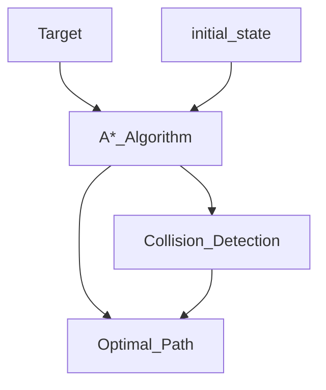

# Robot-Motion-Planning-and-Control

## Table of content
[About](#about)

[Motion Planning](#motion-planning)

[Control Design](#control-design)

[Results](#results)

## About
In this mini-project of Robot Motion Planning And Control I used a 3DOF robotic arm.

## Motion Planning
This section is about the A* algorithm and its implementation in the code to find an optimal path to the target

**Examples of use the algorithm to find the optimal path**
)

## Control Design
This section is about the control design of the robotic arm

## Results

